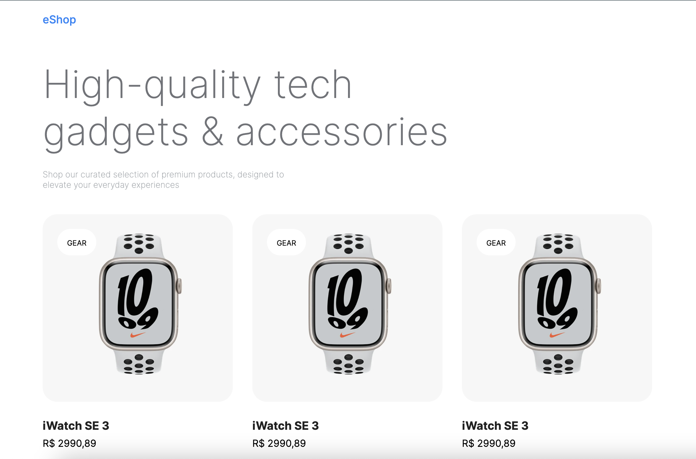

## eShop - Front Store

> Demonstration

## Inspirated in:
https://techwave.framer.website/
https://ecommerce-uikit.com/preview.html
https://ui8.net/designe-studio/products/rika---ecommerce-mobile-app-ui-kit
https://bazaar.ui-lib.com/products/kossil-watch-brown
https://www.figma.com/file/Mm4HiMIeqRsAXPiKDxv1o5/Figma-E-Commerce-System-1.0?type=design&node-id=3182-4029&mode=design&t=5IdwhsJZj0D8xASn-0
https://www.figma.com/file/xmLSdIpE4kIdtzcDo3tPKV/E-commerce-%E2%80%94-Free-UI-Kit-(Community)?type=design&node-id=0-1&mode=design&t=pq3kmLmuYODui8hG-0
https://sabinovision.com/

https://demo.evershop.io/admin/orders
demo@evershop.io
123456

# Novas referencias
https://www.untitledui.com/components/buttons
https://dribbble.com/shots/7958069-UI-Components-Buttons-Core-Design-System#
https://tailwindui.com/components/application-ui/elements/buttons
https://ui.shadcn.com/blocks
https://ui.shadcn.com/docs/components/resizable
https://www.figma.com/file/gkFlrAZH7P05JnOGh0J0c3/Shopping-Ecommerce-Website-UI-Kit---UI8-(Community)?type=design&node-id=113-7674&mode=design&t=QY6ktqLdFpJzFA6f-0
https://www.figma.com/file/fIuZJrv61nej4k0kydp1bE/Minimal-E-Commerce-App---Design-System-(Community)?type=design&node-id=61-215&mode=design&t=BiWWPmd5X6XGdL59-0

### Referencia principal
https://www.figma.com/file/Mm4HiMIeqRsAXPiKDxv1o5/Figma-E-Commerce-System-1.0?type=design&node-id=1-264&mode=design&t=JCfIZoRLkzj0R302-0

## O que esse projeto contempla?
- Server Components
- Client Components
- Client Bounderies
- State Management
  - Server Side State Management
- Dynamic Routes
- Aninhated Layouts
- Route Handlers
  /api/{route}
- Metadata
- Route Groups
- Server Actions
- URL Query Params
- Headers
- Redirect