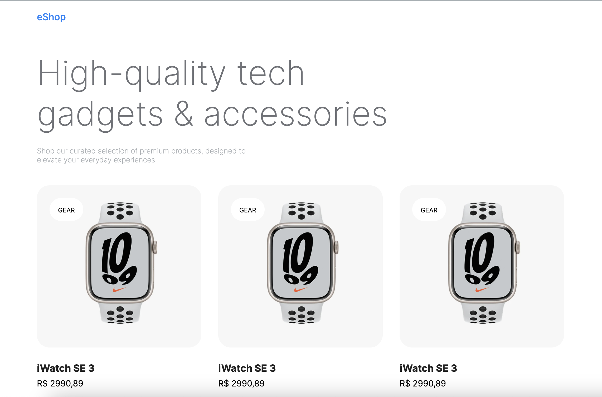

## eShop - Front Store

> Demonstration

## Inspirated in:

https://techwave.framer.website/
https://ecommerce-uikit.com/preview.html
https://ui8.net/designe-studio/products/rika---ecommerce-mobile-app-ui-kit
https://bazaar.ui-lib.com/products/kossil-watch-brown
https://www.figma.com/file/Mm4HiMIeqRsAXPiKDxv1o5/Figma-E-Commerce-System-1.0?type=design&node-id=3182-4029&mode=design&t=5IdwhsJZj0D8xASn-0
https://www.figma.com/file/xmLSdIpE4kIdtzcDo3tPKV/E-commerce-%E2%80%94-Free-UI-Kit-(Community)?type=design&node-id=0-1&mode=design&t=pq3kmLmuYODui8hG-0
https://sabinovision.com/

https://demo.evershop.io/admin/orders
demo@evershop.io
123456

# Novas referencias

https://www.untitledui.com/components/buttons
https://dribbble.com/shots/7958069-UI-Components-Buttons-Core-Design-System#
https://tailwindui.com/components/application-ui/elements/buttons
https://ui.shadcn.com/blocks
https://ui.shadcn.com/docs/components/resizable
https://www.figma.com/file/gkFlrAZH7P05JnOGh0J0c3/Shopping-Ecommerce-Website-UI-Kit---UI8-(Community)?type=design&node-id=113-7674&mode=design&t=QY6ktqLdFpJzFA6f-0
https://www.figma.com/file/fIuZJrv61nej4k0kydp1bE/Minimal-E-Commerce-App---Design-System-(Community)?type=design&node-id=61-215&mode=design&t=BiWWPmd5X6XGdL59-0

### Referencia principal

https://www.figma.com/file/Mm4HiMIeqRsAXPiKDxv1o5/Figma-E-Commerce-System-1.0?type=design&node-id=1-264&mode=design&t=JCfIZoRLkzj0R302-0

## O que esse projeto contempla?

- Server Components
- Client Components
- Client Bounderies
- State Management
  - Server Side State Management
- Dynamic Routes
- Aninhated Layouts
- Route Handlers
  /api/{route}
- Metadata
- Route Groups
- Server Actions
- URL Query Params
- Headers
- Redirect
- API Wrapper

# Epics

## E - Autenticação

### Tela de login

#### User Storie

Epicos: Autenticacao
Feature:

- Login de usuario
  - story:

**Integracoes**

#### Features:

- Implementação do Login Social

  - [UI] - Adicionar Botões de Login Social na Interface

    > Como usuário, quero poder acessar o sistema usando minhas contas de redes sociais (Google, Facebook) para facilitar o processo de login.

    > > Critérios de Aceitação:

    - Os botões de login social devem aparecer na tela de login.
    - Cada botão deve ter o ícone e estilo visual correspondente ao provedor (Google, Facebook, etc.).
    - Ao clicar em um botão, o usuário deve ser redirecionado para a autenticação do provedor.
    - Deve haver um tratamento de feedback visual (loading e possíveis erros).

    > > Tarefas:

    - Criar os componentes de botão para login social.
    - Estilizar os botões de acordo com as diretrizes dos provedores (Google, Facebook).
    - Adicionar os botões de login social à tela de login.
    - Implementar um mecanismo de feedback visual (ex: estado de carregamento e tratamento de erros).
    - Escrever testes de interface para validar a presença e funcionalidade dos botões.
    - Adicionar serviço que dispara os dados para validação

  - [Integrações] - Implementar a Autenticação com Provedores de Login Social

    > Como desenvolvedor, preciso implementar a lógica de autenticação com provedores de login social para autenticar usuários por meio do Google e Facebook.

    > > Critérios de Aceitação:

    - A aplicação deve usar as APIs dos provedores para autenticar o usuário (OAuth 2.0, OpenID Connect).
    - Os tokens de autenticação retornados pelos provedores devem ser validados e gerenciados pela aplicação.
    - A aplicação deve lidar com erros de autenticação (ex: cancelamento pelo usuário, falha na resposta do provedor).

    > > Tarefas

    - Configurar as bibliotecas de autenticação (ex: OAuth, OpenID Connect) para os provedores escolhidos.
    - Implementar a lógica de autenticação para Google.
    - Implementar a lógica de autenticação para Facebook.
    - Implementar tratamento de erros específicos para cada provedor
    - Adicionar o redirecionamento do usuário após login bem-sucedido.

- Integração com o serviço Authorizer

  - Configurar Cliente HTTP para Serviço Interno

    > Como desenvolvedor, eu quero configurar um cliente HTTP para se comunicar com os serviços internos da empresa para que possamos consumir as APIs com autenticação adequada.

    > > Critérios de Aceitação:

    - O cliente HTTP deve suportar autenticação (ex: tokens JWT).
    - Deve permitir a configuração de cabeçalhos padrão (ex: Authorization).
    - Deve incluir tratamento de erros e retorno de mensagens claras em caso de falhas.

    > > Tarefas

    - Escolher e configurar a biblioteca HTTP (ex: Axios, Fetch) para o módulo.
    - Implementar um cliente HTTP que inclua tokens de autenticação nos cabeçalhos das requisições.
    - Implementar tratamento de erros com mensagens claras (ex: mensagens de timeout, autenticação falha).
    - Adicionar suporte a rotas dinâmicas e parâmetros de requisição.
    - Criar testes unitários para validar a comunicação com o serviço.

**Integracoes (epico)**

- `feature` - Configurações de comunicação

  > Abrange todas as operações necessárias para criar e configurar os clientes HTTP que irão consumir os serviços internos e externos da empresa.

  - `user story` - Configurar Cliente HTTP para Serviço Interno

  > Como desenvolvedor, eu quero configurar um cliente HTTP para se comunicar com os serviços internos da empresa para que possamos consumir as APIs com autenticação adequada.

  > > Critérios de Aceitação:

  - O cliente HTTP deve suportar autenticação (ex: tokens JWT).
  - Deve permitir a configuração de cabeçalhos padrão (ex: Authorization).
  - Deve incluir tratamento de erros e retorno de mensagens claras em caso de falhas.

  > > Tarefas

  - Escolher e configurar a biblioteca HTTP (ex: Axios, Fetch) para o módulo.
  - Implementar um cliente HTTP que inclua tokens de autenticação nos cabeçalhos das requisições.
  - Implementar tratamento de erros com mensagens claras (ex: mensagens de timeout, autenticação falha).
  - Adicionar suporte a rotas dinâmicas e parâmetros de requisição.
  - Criar testes unitários para validar a comunicação com o serviço.

- `feature` - Integração com Serviço de Autenticação

  > Envolve todas as operações e funcionalidades necessárias para se comunicar com o serviço de autenticação, como login, registro, renovação de token, etc.

  - Autenticar do usuário

    > Como usuário, eu quero poder me autenticar no sistema para acessar minhas informações

    > > Tarefas

    - Definir DTO para requisição de autenticação
    - Criar método de autenticação
    - Implementar o endpoint de autenticação

      > > > Critérios

      - A chamada ao serviço deve ser do tipo POST

  - Permitir recuperação de senha

    > Como usuário, eu quero poder recuperar a minha senha

    > > Tarefas

    - Criar a rota de API

      > > > Critérios

      - Implementar a rota POST para enviar os dados de validação
      - Implementar lógica de validacao dos dados
